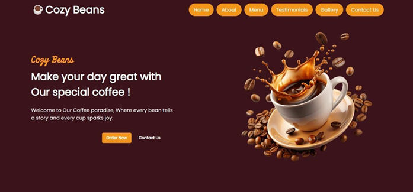
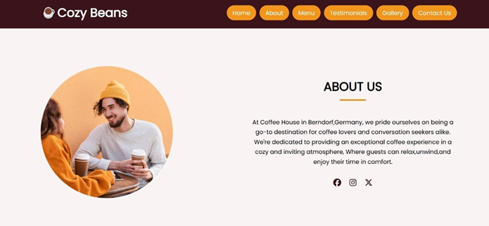
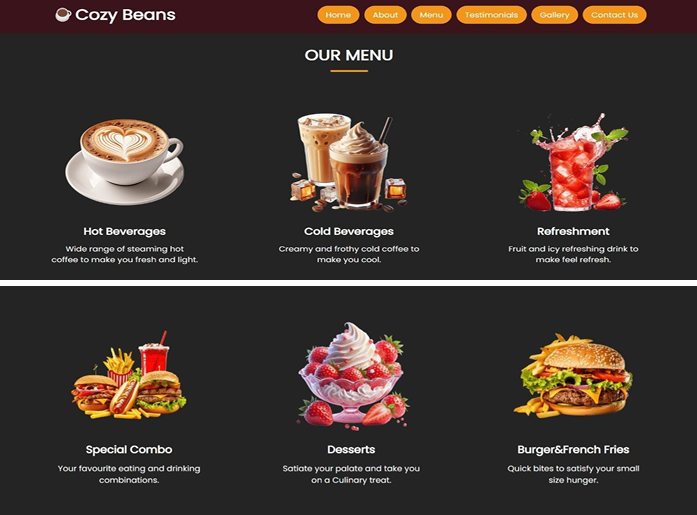
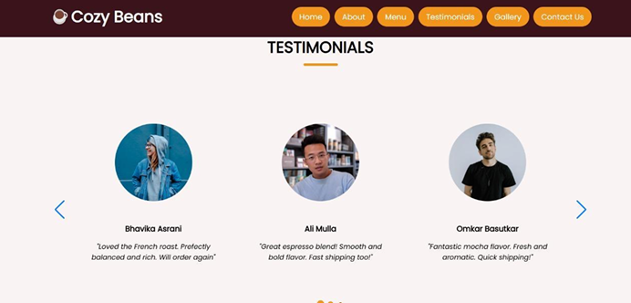
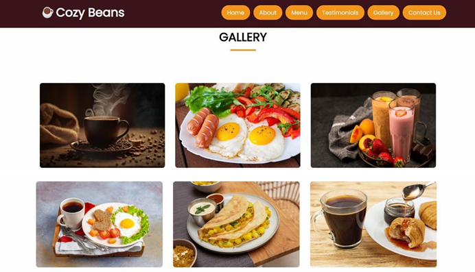
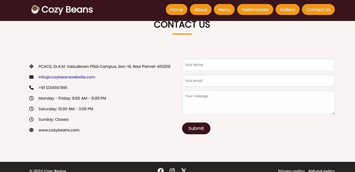

# ☕ Cozy Beans Coffee Shop Website

A responsive and modern coffee shop website developed as a front-end web development project. The website provides an engaging user experience through a clean interface, interactive sections, and responsive design. It showcases the café's menu, customer testimonials, gallery, and contact information while maintaining a warm coffee-inspired theme.

---

## 📖 Overview

Cozy Beans is a static coffee shop website created to demonstrate modern front-end web development concepts using HTML, CSS, JavaScript, Bootstrap, and Swiper.js. The project focuses on responsive design, smooth navigation, and an attractive user interface.

---

## ✨ Features

- Responsive website design
- Modern landing page with Hero section
- About Us section
- Interactive Coffee Menu
- Customer Testimonials Slider
- Image Gallery
- Contact Us page
- Smooth scrolling navigation
- Mobile-friendly layout
- Clean and modern user interface

---

## 🛠 Technologies Used

- HTML5
- CSS3
- JavaScript
- Bootstrap
- Swiper.js

---

## 📂 Project Structure

```
CozyBeans/
│── images/
│── screenshots/
│── index.html
│── style.css
│── script.js
└── README.md
```

---

## Screenshots

### Home Page


### About Us


### Menu


### Testimonials


### Gallery


### Contact Us


---

## 🚀 How to Run

1. Download or clone the repository.
2. Open the project folder.
3. Open `index.html` in any modern web browser.
4. Explore the website.

No additional installation is required.

---

## 📚 Learning Outcomes

This project helped in understanding:

- Responsive Web Design
- HTML Page Structure
- CSS Styling and Layout
- JavaScript DOM Manipulation
- Bootstrap Components
- Swiper.js Integration
- Website Navigation Design

---

## 🔮 Future Enhancements

- Online Ordering System
- Shopping Cart
- User Login & Registration
- Payment Gateway Integration
- Table Reservation System
- Backend Database Integration
- Admin Dashboard

---

## 👩‍💻 Author

**Vaidehi Shankar Patil**

Bachelor of Computer Applications (BCA) Student

Pillai College of Arts, Science & Commerce

---

## 📄 License

This project was developed for educational purposes as part of the Bachelor of Computer Applications curriculum.
